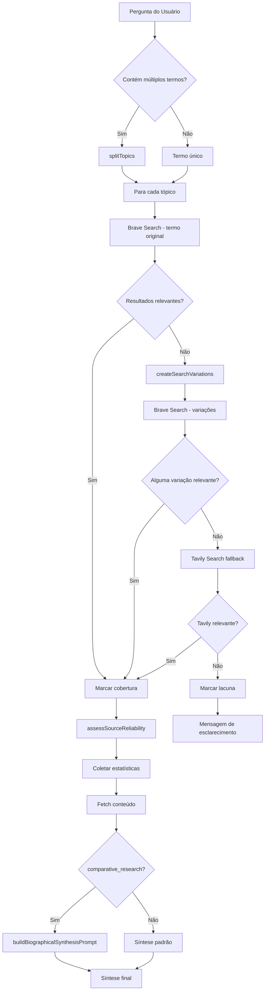

# Research Guidelines - Worion Desktop

**Última atualização:** 2026-05-23  
**Versão:** 2.0 - Pipeline de Pesquisa Aprimorado

---

## 📋 Visão Geral

Este documento descreve as diretrizes de pesquisa implementadas no Worion Desktop para garantir resultados precisos, confiáveis e estruturados. O pipeline foi projetado para lidar com perguntas complexas envolvendo múltiplos termos, variações ortográficas e síntese comparativa.

---

## 🔍 Pipeline de Pesquisa

### 1. Divisão de Tópicos

**Função:** `splitTopics(text)` em `chat-routing.js`

**Comportamento:**
- Divide perguntas contendo múltiplos termos separados por vírgulas, " e ", " and ", " versus " ou " vs."
- Exemplo: "Pesquise sobre Helena Blavatsky, Bashar e Jan Val Ellam" → 3 tópicos individuais
- Filtra segmentos vazios ou muito curtos (< 3 caracteres)

**Uso:**
```javascript
const topics = splitTopics("Helena Blavatsky, Bashar, Jan Val Ellam");
// Resultado: ["Helena Blavatsky", "Bashar", "Jan Val Ellam"]
```

---

### 2. Variações de Busca

**Função:** `createSearchVariations(term)` em `chat-models.js`

**Objetivo:** Mitigar erros de digitação e encontrar termos mesmo com ortografia incorreta.

**Variações Criadas:**
1. **Original:** Termo exato fornecido pelo usuário
2. **Sem acentos:** Remove acentuação (á→a, é→e, ç→c, etc.)
3. **Espaços normalizados:** Remove espaços duplos/triplos
4. **Busca exata:** Adiciona aspas para nomes próprios

**Exemplo:**
```javascript
createSearchVariations("Helena bravatisk");
// Resultado: [
//   "Helena bravatisk",
//   "Helena bravatisk", // sem acentos (igual neste caso)
//   '"Helena bravatisk"' // busca exata
// ]
```

**Estratégia de Fallback:**
1. Tenta busca com termo original
2. Se não houver resultados relevantes, tenta cada variação sequencialmente
3. Para assim que encontrar resultados relevantes
4. Marca o método usado: `brave`, `brave-variation`, `tavily`, etc.

---

### 3. Verificação de Relevância

**Função:** `verifyTopicRelevance(topic, results)` em `chat-models.js`

**Objetivo:** Garantir que os resultados realmente mencionam o termo pesquisado.

**Lógica:**
1. Normaliza o tópico (remove acentos, lowercase)
2. Extrai termos principais (palavras com 4+ caracteres, exceto stopwords)
3. Verifica se pelo menos um termo aparece no título ou snippet dos resultados
4. Retorna `true` apenas se houver correspondência real

**Exemplo:**
```javascript
// Busca por "Jan Val Ellam"
// Termos principais extraídos: ["ellam"]
// Resultados que contêm "ellam" no título/snippet → relevante: true
// Resultados apenas sobre "Jan" genérico → relevante: false
```

---

### 4. Avaliação de Confiabilidade

**Função:** `assessSourceReliability(url)` em `chat-models.js`

**Categorias de Confiabilidade:**

#### **Alta Confiabilidade** (✓ Confiável)
- `.edu`, `.gov`, `.org`
- Enciclopédias: Wikipedia, Britannica, Encyclopedia.com
- Portais de notícias: BBC, Reuters, AP News, NY Times, The Guardian, Folha, Estadão, G1
- Acadêmicas: Nature, Science, JSTOR, PubMed, SciELO, Google Scholar

#### **Baixa Confiabilidade** (⚠ Baixa confiabilidade)
- Blogs pessoais: Medium, Substack, WordPress, Blogspot
- Redes sociais: YouTube, Facebook, Instagram, Twitter, TikTok
- E-commerce: Amazon, Mercado Livre, Shopee

#### **Confiabilidade Geral** (padrão)
- Sites .com ou outros domínios não categorizados explicitamente
- Considerados "confiáveis" por padrão, mas com categoria "general-web"

**Saída:**
```javascript
assessSourceReliability("https://wikipedia.org/wiki/Helena_Blavatsky");
// { reliable: true, category: 'academic-news-encyclopedia' }

assessSourceReliability("https://youtube.com/watch?v=xyz");
// { reliable: false, category: 'social-commerce' }
```

**Uso no Pipeline:**
- Cada fonte coletada recebe avaliação de confiabilidade
- Estatísticas são agregadas por tópico
- Se < 50% das fontes forem confiáveis, exibe alerta ao usuário

---

### 5. Síntese Estruturada de Biografias

**Função:** `buildBiographicalSynthesisPrompt(topicsData)` em `chat-models.js`

**Objetivo:** Fornecer estrutura consistente para sínteses comparativas de pessoas, entidades ou doutrinas.

**Estrutura da Resposta:**

Para cada tópico:
1. **Quem é / O que é**: Biografia resumida, origem, contexto
2. **Principais obras/doutrinas**: Livros, ensinamentos centrais, filosofias
3. **Controvérsias ou críticas**: Se houver, mencione de forma equilibrada
4. **Fontes confiáveis vs. limitações**: Indique se as fontes são acadêmicas/jornalísticas ou apenas promocionais/testemunhais

Para pesquisas comparativas (2+ tópicos):
5. **Pontos em comum**: Identifique temas, conceitos ou abordagens compartilhadas
6. **Diferenças principais**: Destaque divergências importantes em doutrinas, origens ou metodologias

**Formato de Saída:**
- Markdown estruturado (##, ###, **negrito**, listas)
- Citações factuais das fontes
- Declaração explícita de limitações: "As fontes disponíveis são limitadas a blogs e canais de podcast"
- Ao final: opção de aprofundamento ("Deseja que eu liste as obras principais de X?")

**Exemplo de Uso:**
```
Pesquise sobre Helena Blavatsky e Bashar
```

**Resposta Esperada:**
```markdown
## Helena Blavatsky

**Quem foi:** Helena Petrovna Blavatsky (1831-1891) foi uma ocultista russa, cofundadora 
da Sociedade Teosófica em 1875...

**Principais obras:**
- "A Doutrina Secreta" (1888)
- "Ísis sem Véu" (1877)

**Controvérsias:** Acusada de fraude por críticos, mas influente no movimento espiritualista...

**Fontes:** Wikipedia, Britannica (✓ Confiáveis)

---

## Bashar

**Quem é:** Bashar é uma entidade canalizada pelo médium norte-americano Darryl Anka 
desde 1983. Segundo Anka, Bashar vem de Essassani...

**Principais ensinamentos:**
- Cinco Leis da Criação
- Lei da Atração aplicada

**Fontes:** ⚠ Limitadas a blogs pessoais, canais YouTube e sites promocionais

---

## Análise Comparativa

**Pontos em comum:**
- Ambos tratam de contato extraterrestre
- Abordam múltiplas realidades e dimensões

**Diferenças principais:**
- Blavatsky: Filosofia teosófica codificada em livros acadêmicos
- Bashar: Ensinamentos orais via canalização, sem obras escritas formais

---

**Deseja que eu liste as obras completas de Helena Blavatsky ou explique detalhadamente 
as Cinco Leis da Criação de Bashar?**
```

---

## 📊 Métricas e Rastreamento

### Estatísticas de Confiabilidade

O pipeline rastreia automaticamente:
- Número total de fontes coletadas por tópico
- Fontes confiáveis vs. não confiáveis
- Percentual de confiabilidade

**Exemplo de Log:**
```
AVALIAÇÃO DE CONFIABILIDADE DAS FONTES:
- Helena Blavatsky: 4 confiáveis / 1 não confiável (80% confiáveis)
- Bashar: 1 confiável / 5 não confiáveis (17% confiáveis) ⚠ ATENÇÃO: Maioria das fontes são blogs/redes sociais
```

### Cobertura de Tópicos

Cada tópico é rastreado com:
- `sources`: Número de resultados encontrados
- `method`: Método de busca usado (`brave`, `brave-variation`, `tavily`, `none`)
- `isRelevant`: Se os resultados são relevantes
- `usedVariation`: Se usou variação de busca, qual foi

**Exemplo:**
```javascript
topicCoverage = {
  "Helena Blavatsky": {
    sources: 8,
    method: "brave",
    isRelevant: true
  },
  "Helena bravatisk": {
    sources: 6,
    method: "brave-variation",
    isRelevant: true,
    usedVariation: "Helena blavatsky" // sem acento corrigiu
  },
  "Bashar": {
    sources: 0,
    method: "none",
    isRelevant: false
  }
}
```

---

## 🚨 Tratamento de Lacunas

### Tipos de Lacunas

1. **Termo desconhecido** (`method: 'none'`)
   - Nenhum resultado encontrado mesmo com variações
   - Mensagem: "Nenhum resultado encontrado (termo pode estar incorreto ou ser muito específico)"
   - Sugestão: Verificar grafia

2. **Resultados irrelevantes** (`method: 'brave-irrelevant'` ou `'tavily-irrelevant'`)
   - Resultados encontrados mas não mencionam o termo
   - Mensagem: "Resultados encontrados mas não relacionados ao termo"
   - Sugestão: Especificar melhor o que procura

3. **Fontes não confiáveis** (< 50% confiáveis)
   - Resultados encontrados mas maioria são blogs/redes sociais
   - Mensagem: "⚠ ATENÇÃO: Maioria das fontes são blogs/redes sociais"
   - Declaração: "As fontes disponíveis são limitadas a blogs e canais de podcast"

### Mensagens de Esclarecimento

Quando há lacunas, o sistema pede esclarecimento detalhado:

```
Consultei as fontes disponíveis (Brave e Tavily), mas não encontrei material 
confiável suficiente para responder com segurança.

**Termos sem resultados encontrados:**
- "Jan Val Ellam" → Por favor, verifique a grafia ou forneça mais contexto sobre este termo.

**Termos com resultados não relacionados:**
- "Bashar" → Os resultados encontrados não parecem relacionados. Poderia especificar melhor o que procura?

Por favor, reformule a pergunta ou forneça mais detalhes sobre o que está procurando.
```

---

## 🎯 Rotas de Execução

### `comparative_research`

**Quando acionada:**
- Pergunta contém "compare", "comparar", "versus", "vs."
- Pergunta tem formato "entre X e Y"

**Comportamento especial:**
1. Usa `extractCandidateResearchAxes()` para identificar eixos de comparação
2. Cria queries específicas para cada eixo
3. Aplica `buildBiographicalSynthesisPrompt()` para estruturar resposta
4. Compara APENAS tópicos com material suficiente
5. Declara lacunas explicitamente para tópicos sem fontes

**Exemplo:**
```
Pergunta: "Compare Helena Blavatsky e Bashar"
Eixos detectados: ["Helena Blavatsky", "Bashar"]
Síntese: Biografia + Pontos em comum + Diferenças
```

### `focused_research`

**Quando acionada:**
- Pergunta pede "pesquise", "busque", "procure"
- Pergunta tem palavras-chave de pesquisa (quem, qual, quando, etc.)

**Comportamento:**
- Busca focada (maxSearches: 1, maxFetches: 3)
- Usa variações de busca para termos desconhecidos
- Verifica relevância antes de marcar como cobertura válida

### `deep_research`

**Quando acionada:**
- Pergunta pede "riqueza de detalhes", "análise densa", "pesquisa profunda"

**Comportamento:**
- Busca profunda (maxSearches: 2, maxFetches: 5, maxTokens: 24000)
- Usa Tavily com `search_depth: 'advanced'`
- Coleta mais conteúdo por página (até 16000 caracteres)

---

## 🔄 Fluxo de Execução



---

## 📝 Exemplos Práticos

### Exemplo 1: Termo com Grafia Incorreta

**Input:**
```
Pesquise sobre Helena bravatisk
```

**Processo:**
1. Brave Search: "Helena bravatisk" → 0 resultados relevantes
2. Variações criadas: ["Helena bravatisk", "Helena bravatisk", '"Helena bravatisk"']
3. Brave Search variação: "Helena bravatisk" (sem acento) → encontra "Helena Blavatsky"
4. Marca: `method: 'brave-variation'`, `usedVariation: 'Helena bravatisk'`

**Output:**
```
## Helena Blavatsky

(Nota: A busca foi ajustada para "Helena Blavatsky" - verificar se era o termo pretendido)

**Quem foi:** Helena Petrovna Blavatsky (1831-1891)...
```

---

### Exemplo 2: Comparação com Lacunas

**Input:**
```
Compare Helena Blavatsky, Bashar e Jan Val Ellam
```

**Processo:**
1. 3 tópicos identificados
2. **Helena Blavatsky:** 8 fontes confiáveis (Wikipedia, Britannica)
3. **Bashar:** 6 fontes não confiáveis (blogs, YouTube)
4. **Jan Val Ellam:** 4 fontes não confiáveis (sites promocionais)

**Output:**
```
## Helena Blavatsky
[Síntese completa com fontes acadêmicas]

## Bashar
⚠ As fontes disponíveis são limitadas a blogs e canais de podcast.
[Síntese com ressalvas]

## Jan Val Ellam
⚠ As fontes disponíveis são limitadas a sites promocionais e canais de YouTube.
[Síntese com ressalvas]

## Análise Comparativa
**Pontos em comum:** 
- Todos abordam espiritualidade e contato extraterrestre
- Defendem existência de múltiplas realidades

**Diferenças principais:**
- Blavatsky: Filosofia codificada, reconhecimento acadêmico
- Bashar/Ellam: Ensinamentos orais via canalização, sem validação acadêmica

**Deseja aprofundar em algum tópico específico?**
- Listar obras completas de Helena Blavatsky
- Explicar as Cinco Leis da Criação de Bashar
- Detalhar a cosmologia de Jan Val Ellam
```

---

### Exemplo 3: Termo Totalmente Desconhecido

**Input:**
```
Pesquise sobre Xylophtor
```

**Processo:**
1. Brave Search: "Xylophtor" → 0 resultados
2. Variações: ["Xylophtor", "Xylophtor", '"Xylophtor"'] → 0 resultados
3. Tavily Search: "Xylophtor" → 0 resultados

**Output:**
```
Consultei as fontes disponíveis (Brave e Tavily), mas não encontrei material 
confiável suficiente para responder com segurança.

**Termos sem resultados encontrados:**
- "Xylophtor" → Por favor, verifique a grafia ou forneça mais contexto sobre este termo.

Por favor, reformule a pergunta ou forneça mais detalhes sobre o que está procurando.
```

---

## 🛠️ Configuração e Manutenção

### Adicionar Novos Domínios Confiáveis

Editar `assessSourceReliability()` em `chat-models.js`:

```javascript
const highlyReliable = [
  '.edu', '.gov', '.org',
  'wikipedia.org', 'britannica.com',
  // Adicionar novo domínio aqui:
  'newdomain.com'
];
```

### Ajustar Threshold de Confiabilidade

Para mudar o limite de alerta de 50% para outro valor:

```javascript
// Linha ~1234 em chat-models.js
const warning = reliablePercent < 50  // Alterar 50 para novo valor
  ? ' ⚠ ATENÇÃO: Maioria das fontes são blogs/redes sociais'
  : '';
```

### Desativar Variações de Busca

Se preferir não usar variações automáticas:

```javascript
// Comentar bloco nas linhas ~870-900 em chat-models.js
// if (braveResults.length === 0 || !isRelevant) {
//   console.log('[RESEARCH ROUTE] Trying search variations for:', query);
//   ...
// }
```

---

## 📌 Referências

- **Arquivo principal:** `js/chat-models.js`
- **Roteamento:** `js/chat-routing.js`
- **Changelog detalhado:** `docs/ANALIZES/root-docs/CHANGELOG-PESQUISA-REFINADA.md`
- **Funções-chave:**
  - `createSearchVariations()` - linha ~602
  - `assessSourceReliability()` - linha ~630
  - `verifyTopicRelevance()` - linha ~700
  - `buildBiographicalSynthesisPrompt()` - linha ~732
  - `runDeterministicResearchRoute()` - linha ~794

---

## 🔮 Próximas Melhorias

- [ ] Cache de variações de busca bem-sucedidas
- [ ] Sugestões automáticas "Você quis dizer...?" (like Google)
- [ ] Integração com APIs de verificação de fatos (FactCheck.org)
- [ ] Análise de sentimento em fontes controversas
- [ ] Métricas de credibilidade por autor/domínio (reputação acumulada)

---

**Versão:** 2.0  
**Última atualização:** 2026-05-23  
**Mantido por:** Equipe Worion Desktop
